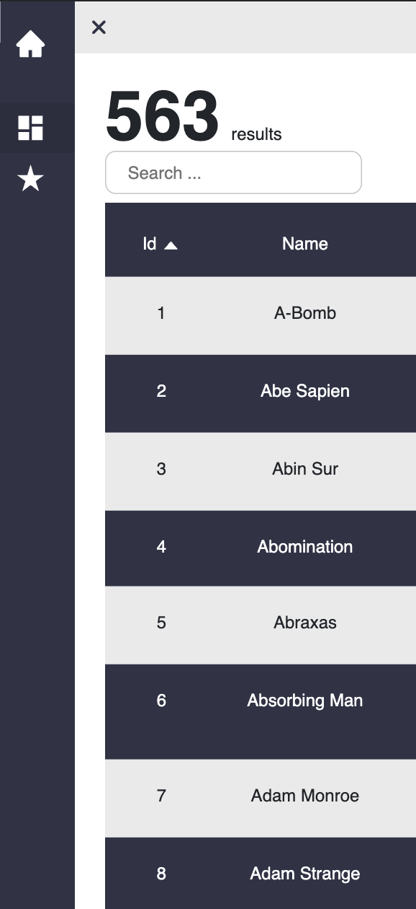

<h1 align="center">
     Super Hero - Front 
    ReactJS
</h1>

# 🚀 O Projeto

Esse projeto consiste no consumo da [SuperHero Api ](https://akabab.github.io/superhero-api/api/) para listar, favoritar, editar e excluir personagens. 

# 🔩 Tecnologias
- [React.js](https://pt-br.reactjs.org/)
- [Docker](https://www.docker.com/)

# 🔩 Screenshots

    <h2>Home Page</h2>
    
    <h2>Busca</h2>
    
    <h2>Detalhes</h2>
    
    <h2>Favoritos</h2>
    
    <h2>Mobile - Home</h2>
    
    <h2>Mobile - Favorites</h2>
    
    <h2>Navegação Mobile</h2>
    <iframe src="./src/assets/screenshots/mobile-navigation.mp4" width="700px">

## 🏃 Executando

> Para executar a aplicação **Web** e **Mobile**:
    
    yarn start

> Para executar o **api**, utilize:

    yarn dev
